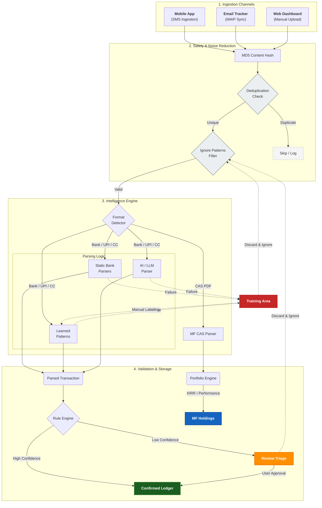

# WealthFam

> [!IMPORTANT]
> **WealthFam** is a premium, AI-driven personal and family finance management platform designed for the modern household.


## 🚀 Overview

WealthFam provides a holistic view of your financial health. From daily expense tracking to complex investment management and AI-powered intelligence, WealthFam is built to help families refine their finances and achieve long-term growth.

## ✨ Key Features

### 🏦 Holistic Dashboard
- **Real-time Balance Sheet**: Instantly view your Net Worth, Liquidity, and Debt.
- **Spending Velocity**: Track your monthly spend with live sparklines and category-wise breakdowns.
- **Budget Pulse**: Monitor your budget health across different categories at a glance.

### 📈 Advanced Mutual Funds Tracking
- **Unified Portfolio**: Manage multiple folios and family members in one place.
- **XIRR & Performance**: Automated performance tracking with XIRR calculations and historical growth timelines.
- **Market Intelligence**: Live monitoring of major indices (NIFTY 50, SENSEX) and AMC-specific insights.
- **CAS Import**: Seamlessly ingest data from CAMS/KFintech via PDF upload or automated email scanning.

### 🤖 AI Financial Intelligence
- **Deep Insights**: Generate personalized spending vectors and optimization strategies using AI.
- **Predictive Analytics**: Forecast your future balance based on historical velocity and upcoming subscriptions.
- **Smart Categorization**: Automated classification of transactions for effortless organization.

### 💳 Credit Intelligence
- **Utilization Tracking**: Keep an eye on your credit card limits and utilization ratios.
- **Billing Cycles**: Stay ahead with notifications for upcoming bills and due dates.
- **Spending Patterns**: Specialized analytics for weekend vs. weekday spending and top merchant analysis.

### 🗓️ Subscription Management
- **Recurring Transactions**: Track all your active subscriptions and recurring bills.
- **Forecast Integration**: Subscriptions are automatically factored into your liquidity projections.

## 🛠️ Tech Stack

### Frontend
- **Framework**: [Vue.js 3](https://vuejs.org/) (Composition API)
- **Language**: [TypeScript](https://www.typescriptlang.org/)
- **Styling**: [Tailwind CSS](https://tailwindcss.com/)
- **Charts**: [Chart.js](https://www.chartjs.org/)
- **State Management**: Pinia

### Mobile App (Companion)
- **Framework**: [Flutter](https://flutter.dev/) (Android)
- **State Management**: Provider
- **Features**: Real-time SMS ingestion, offline retry queue, and manual SMS sync management.
- **Biometrics**: Integration ready for secure access.

#### 📲 Download & Install
[](/mobile_app/build/app/outputs/flutter-apk/app-release.apk)

*Click the banner above to download the latest **WealthFam Mobile APK** directly from this repository.*


### Backend
- **Framework**: [FastAPI](https://fastapi.tiangolo.com/) (Python)
- **Database**: [DuckDB](https://duckdb.org/) (Serverless SQL)
- **ORM**: [SQLAlchemy](https://www.sqlalchemy.org/)
- **Validation**: [Pydantic v2](https://docs.pydantic.dev/)
- **AI Engine**: Gemini Pro for advanced transaction parsing.

## 🐳 Quick Start with Docker
The easiest way to run WealthFam is using our pre-built Docker image. You don't need to build anything yourself!

1. **Create a directory** for your data and configuration:
   ```bash
   mkdir wealthfam && cd wealthfam
   ```

2. **Create a `docker-compose.yml` file**:
   ```yaml
   version: '3.8'
   services:
     wealthfam:
       image: wglabz/wealthfam:latest
       container_name: wealthfam
       restart: unless-stopped
       ports:
         - "80:80"
       volumes:
         - ./data:/data
       environment:
         - DATABASE_URL=duckdb:////data/family_finance_v3.duckdb
   ```

3. **Run the application**:
   ```bash
   docker-compose up -d
   ```
   Open [http://localhost](http://localhost) in your browser.

## 🏁 Getting Started (Development)

### Prerequisites
- Python 3.10+
- Node.js 18+
- npm or yarn

### Installation

1. **Clone the repository**:
   ```bash
   git clone https://github.com/your-org/wealthfam.git
   cd wealthfam
   ```

2. **Setup Backend**:
   ```bash
   cd backend
   python -m venv venv
   source venv/bin/activate # or venv\Scripts\activate on Windows
   pip install -r requirements.txt
   uvicorn app.main:app --reload
   ```

3. **Setup Frontend**:
   ```bash
   cd ../frontend
   npm install
   npm run dev
   ```

## 🔐 Security & Privacy
WealthFam is designed with data privacy at its core. By leveraging DuckDB, your financial data remains in a local, high-performance database, ensuring you have full control over your intelligence.

---
*WealthFam: Refine Your Finances*

## 🔄 Data Ingestion Flow

WealthFam features a sophisticated, multi-channel ingestion pipeline designed to minimize manual entry while maintaining 100% data accuracy through smart deduplication and noise reduction. 

### How it Works:
1.  **Multi-Channel Entry**: Data enters via the **Android Mobile App** (real-time SMS), **Automated Email Scanning** (IMAP sync for txn alerts and CAS statements), or **Manual Uploads** (Bank CSVs and Mutual Fund PDFs).
2.  **Safety & Noise Reduction**:
    *   **MD5 Deduplication**: Every incoming message generates a unique content hash. The system checks this against both confirmed and pending transactions to prevent duplicates even if emails are re-scanned.
    *   **Ignore Patterns**: A global filter that silently drops known "noise" (like login alerts or non-transactional bank updates) based on merchant names or message subjects.
3.  **Tiered Parsing Intelligence**: Validated messages are processed through a three-tier engine:
    *   **Static Parsers**: Hardcoded high-performance logic for major banks.
    *   **Pattern Parser (Learned)**: User-trained regex patterns that evolve as you use the tool.
    *   **AI Fallback**: Large Language Model (Gemini) parsing for complex or unknown formats.
4.  **The Human-in-the-loop**: Messages that fail all parsers are moved to the **Training Area**. Labels generate new patterns, while "Discard & Ignore" actions update the global noise filters.
5.  **Automatic Categorization**: Validated transactions are automatically categorized or sent to **Triage** for final review.

The following diagram illustrates this enhanced end-to-end lifecycle:


```
