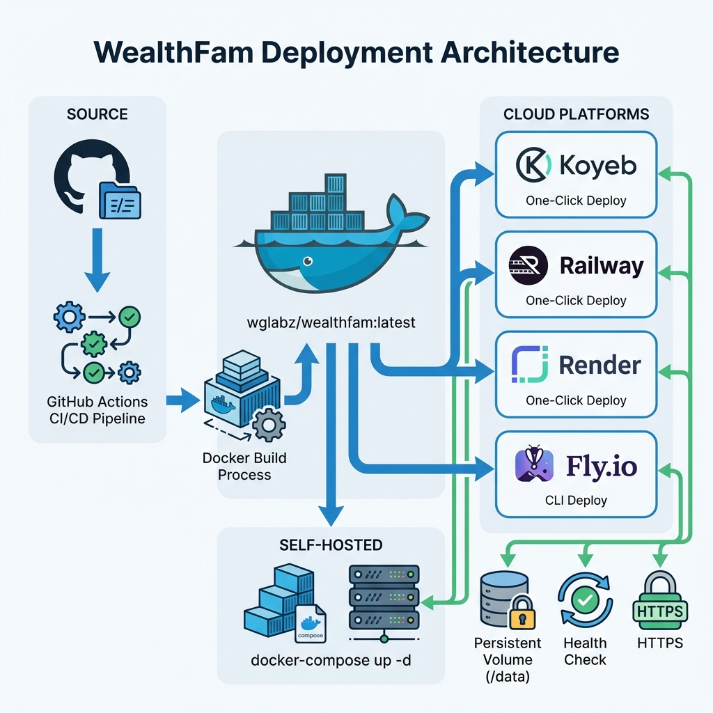

# 🚀 Cloud Deployment Guide

WealthFam can be easily deployed to various cloud platforms with just one click! Choose your preferred platform below.

## 🏗️ Deployment Architecture



Our deployment infrastructure supports multiple platforms with automated CI/CD, health monitoring, and persistent storage.

## ☁️ One-Click Deployment

### Koyeb
[](https://app.koyeb.com/deploy?type=git&repository=github.com/oksbwn/wealthfam&branch=main&name=wealthfam)

**Features:**
- Free tier available
- Automatic SSL certificates
- Global edge network
- Persistent storage support

**Quick Steps:**
1. Click the "Deploy to Koyeb" button above
2. Sign in with your GitHub account
3. Select your repository
4. Configure environment variables (optional)
5. Click "Deploy"

---

### Railway
[](https://railway.app/template/wealthfam)

**Features:**
- $5 free credit monthly
- Automatic deployments
- Built-in metrics
- Simple pricing

**Quick Steps:**
1. Click the "Deploy on Railway" button
2. Connect your GitHub account
3. Configure environment variables
4. Deploy with one click

---

### Render
[](https://render.com/deploy?repo=https://github.com/oksbwn/wealthfam)

**Features:**
- Free tier for web services
- Automatic SSL
- DDoS protection
- Persistent disks

**Quick Steps:**
1. Click the "Deploy to Render" button
2. Create a new Web Service
3. Point to your repository
4. Render will auto-detect the Dockerfile
5. Add a persistent disk at `/data` (1GB recommended)

---

### Fly.io
**Quick Deploy:**
```bash
# Install flyctl
curl -L https://fly.io/install.sh | sh

# Login
flyctl auth login

# Clone and deploy
git clone https://github.com/oksbwn/wealthfam.git
cd wealthfam
flyctl launch

# Create persistent volume
flyctl volumes create wealthfam_data --size 1

# Deploy
flyctl deploy
```

**Features:**
- Free tier (3 shared-cpu VMs)
- Global deployment
- Fast cold starts
- Built-in metrics

---

## 🐳 Self-Hosted Docker

For complete control, run WealthFam on your own hardware:

```bash
# Pull the latest image
docker pull wglabz/wealthfam:latest

# Create docker-compose.yml
cat > docker-compose.yml << 'EOF'
version: '3.8'
services:
  wealthfam:
    image: wglabz/wealthfam:latest
    container_name: wealthfam
    restart: unless-stopped
    ports:
      - "80:80"
    volumes:
      - ./data:/data
    environment:
      - DATABASE_URL=duckdb:////data/family_finance_v3.duckdb
EOF

# Start the application
docker-compose up -d

# View logs
docker-compose logs -f
```

**Access:** Open http://localhost in your browser

---

## 🌐 Live Demo

**Demo Instance:** [https://demo.wealthfam.app](https://demo.wealthfam.app)

**Test Credentials:**
- Username: `demo@wealthfam.app`
- Password: `demo123`

> ⚠️ **Note:** Demo data resets every 24 hours. Don't use for production data.

---

## ⚙️ Environment Variables

All platforms support these optional environment variables:

| Variable | Default | Description |
|----------|---------|-------------|
| `DATABASE_URL` | `duckdb:////data/family_finance_v3.duckdb` | Database connection string |
| `PORT` | `80` | HTTP port (some platforms override this) |
| `VITE_APP_BUILD` | `0000` | Build identifier for frontend |
| `GEMINI_API_KEY` | - | Google Gemini API key for AI features |
| `SECRET_KEY` | Auto-generated | JWT secret key |

---

## 📊 Platform Comparison

| Platform | Free Tier | Deploy Time | Difficulty | Best For |
|----------|-----------|-------------|-----------|----------|
| **Koyeb** | ✅ Yes | ~3 min | ⭐ Easy | Quick demos |
| **Railway** | ✅ $5/mo | ~2 min | ⭐ Easy | Hobby projects |
| **Render** | ✅ Yes | ~5 min | ⭐⭐ Medium | Production apps |
| **Fly.io** | ✅ Yes | ~4 min | ⭐⭐ Medium | Global apps |
| **Docker** | N/A | ~1 min | ⭐⭐⭐ Advanced | Full control |

---

## 🔧 Post-Deployment Setup

After deployment:

1. **Access your instance** at the provided URL
2. **Create your account** - First user becomes admin
3. **Configure settings:**
   - Set up email sync (optional)
   - Add your Gemini API key for AI features
   - Configure family members
4. **Start adding transactions!**

---

## 📱 Mobile App Setup

After deploying, configure the mobile app to connect to your instance:

1. Download the [WealthFam Mobile APK](/mobile_app/build/app/outputs/flutter-apk/app-release.apk)
2. Install on your Android device
3. Open Settings → Backend Configuration
4. Enter your deployment URL (e.g., `https://your-app.koyeb.app`)
5. Login with your credentials

---

## 🆘 Troubleshooting

### Database Not Persisting
- Ensure the `/data` volume is properly mounted
- Check platform-specific persistent storage configuration

### Health Check Failing
- Visit `https://your-app-url/health` to see detailed status
- Check if database volume has write permissions

### Build Errors
- Ensure repository is public or platform has access
- Check Dockerfile build logs for specific errors

### Performance Issues
- Consider upgrading to a paid tier for more resources
- Check if you need to increase volume size

---

## 🔐 Security Recommendations

1. **Change default credentials** immediately
2. **Enable HTTPS** (most platforms do this automatically)
3. **Set strong SECRET_KEY** environment variable
4. **Regular backups** of the `/data` directory
5. **Keep your instance updated** to the latest version

---

## 📚 Additional Resources

- [Main README](../README.md) - Full documentation
- [GitHub Issues](https://github.com/oksbwn/wealthfam/issues) - Report bugs
- [Contributing Guide](../CONTRIBUTING.md) - Help improve WealthFam

---

## 💬 Need Help?

- 📧 Email: support@wealthfam.app
- 💬 Discord: [Join our community](https://discord.gg/wealthfam)
- 🐛 Issues: [GitHub Issues](https://github.com/oksbwn/wealthfam/issues)

---

*Deploy your instance today and take control of your finances! 🎉*
